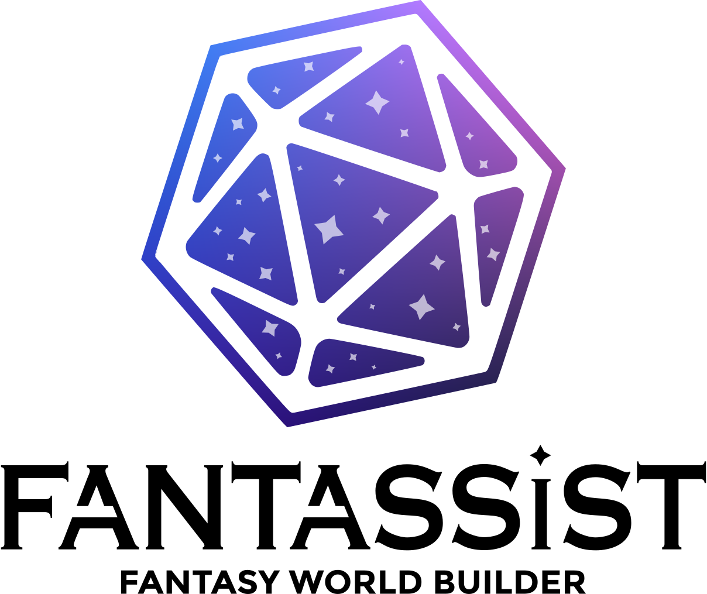

<h1 align="center">
  <a href="https://app.fantassist.io">
    <picture>
      <source media="(prefers-color-scheme: dark)" srcset="docs/icon-full-dark.png" />
      
    </picture>
  </a>
</h1>

<p align="center">
  A local-first virtual tabletop built for physical, in-person play.
</p>

Fantassist is a local-first web app for presenting tabletop maps on a television or secondary display. The game master edits campaigns and scenes privately, then selects the scene shown on the table. Scenes support image maps, fog, colored lights, and obstruction walls.

Fantassist v2 uses an engine-owned scene model and a GPU renderer powered by [**vgpu**](https://vgpu.sh). WebGPU composes scene pixels in the editor, player output, headless renderer, and background thumbnail worker.

## Features

### Campaigns and scenes

- Create, rename, search, export, and delete campaigns and scenes.
- Import and export portable `.scene` files with referenced media embedded.
- Export complete campaigns as tar archives of independently importable scenes.
- Generate versioned scene thumbnails through a serialized background WebGPU worker.
- Store campaigns, scenes, assets, metadata, and thumbnails locally in IndexedDB.

### Map editing

- Upload and arrange image maps across ordered asset layers.
- Drag, resize, rotate, hide, calibrate, and grid-snap assets.
- Create, rename, reorder, hide, and delete asset and fog layers.
- Draw and edit conceal-fog and clear-fog polygons.
- Draw open obstruction walls with endpoint, corner, grid-intersection, and T-junction snapping.
- Manipulate the physical table viewport independently from the editor camera.
- Undo and redo committed scene operations through one engine-owned history.

### Dynamic lighting

- Place multiple colored lights with Bright, Dim, color, and Energy controls.
- Block direct and bounced light with mathematical zero-width wall segments.
- Render fully opaque wall intersections through GPU segment tests.
- Transport diffuse wall bounce through per-light radiance cascades.
- Keep each light's cascade and reachability independent so colors cannot authorize one another across barriers.
- Apply a strict Dim-radius cutoff inside fog while allowing indirect radiance beyond that radius in visible space.
- Use separate latency-oriented editor and higher-quality player-output profiles.

### Table presentation

- Render a dedicated, read-only WebGPU table view in a named window.
- Select detected displays through the Window Management API where available.
- Fall back to 4K, 1080p, custom-resolution, and manually positioned windows.
- Request fullscreen on the selected display and keep the table awake with Screen Wake Lock.
- Keep editor and table scene ownership separate so navigation does not unexpectedly change player output.

## Powered by vgpu

[vgpu](https://vgpu.sh) is the rendering foundation of Fantassist v2. It provides resource, shader, pipeline, target, and frame abstractions for the WebGPU renderer.

The production renderer uses vgpu for:

- `rgba16float` linear-light scene composition.
- Shared editor, table, headless, and thumbnail render passes.
- GPU fog and clear masks with feathered edges.
- Exact finite-segment obstruction tests in WGSL.
- Per-light radiance-cascade atlases merged from far to near through visibility alpha.
- Additive direct and indirect colored-light accumulation.
- Linear-to-sRGB presentation.
- Pipeline prewarming and resource reuse across scene revisions.
- Native Dawn-backed rendering through `vgpu/node`.
- Dedicated-worker WebGPU rendering for cached campaign thumbnails.

The core pass sequence is:

```text
ordered asset layers
  -> fog and clear masks
  -> direct light and exact wall visibility
  -> per-light radiance cascades
  -> fog and lighting composite
  -> editor diagnostics or player output
  -> display conversion
```

WGSL calculates lighting intensity, attenuation, wall visibility, bounce transport, fog masks, and final scene composition. CPU responsibilities are scene-data packing and pass scheduling.

## Architecture

```text
Next.js routes and React features
              |
              v
       immutable scene engine
        |                 |
        v                 v
 local persistence      vgpu render plan
        |                 |
        v                 v
      IndexedDB        WebGPU / WGSL
```

- `apps/v2/src/engine` owns immutable scene state, commands, previews, selection, snapping, and history.
- `apps/v2/src/renderer` owns vgpu resources, projections, render plans, image uploads, and WGSL passes.
- `apps/v2/src/features` owns React workflow composition and renderer lifecycle.
- `apps/v2/src/persistence` owns local storage and scene serialization.
- `apps/v2/scripts` owns Dawn-backed headless rendering and diagnostics.
- `docs/adr` records accepted architecture and product decisions.

The editor, table, headless renderer, and campaign thumbnail worker share the production scene executor.

## Development

Fantassist requires Node.js 24 or newer and npm 11.

```bash
npm install
npm --prefix apps/v2 install
```

Run Fantassist at `http://localhost:3001`:

```bash
npm run dev:v2
```

## Validation

Run the complete v2 validation suite:

```bash
npm run check:v2
```

This runs ESLint, TypeScript, required WGSL validation, engine and persistence tests, native WebGPU pixel tests, and the production Next.js build.

Run the headless scene renderer:

```bash
npm --prefix apps/v2 run render:scene -- \
  --scene spike \
  --profile output \
  --size 640x360 \
  --out artifacts/dynamic-lighting.png
```

## Project status

Fantassist is under active development. The engine-owned editor and vgpu renderer are the current architecture.

Fantassist began as a rework of [dnd-tabletop](https://github.com/tutman96/dnd-tabletop).
